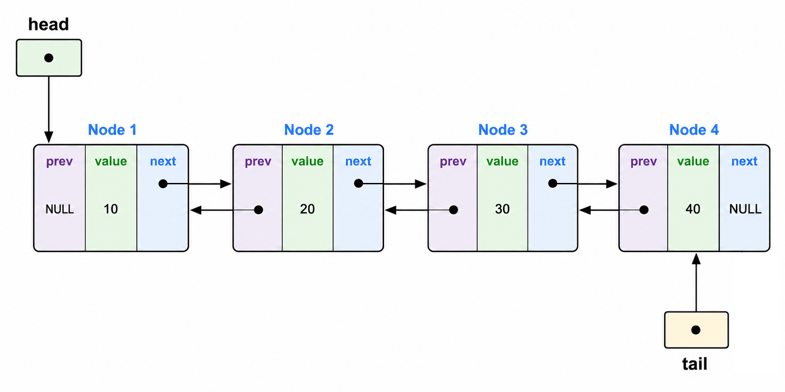
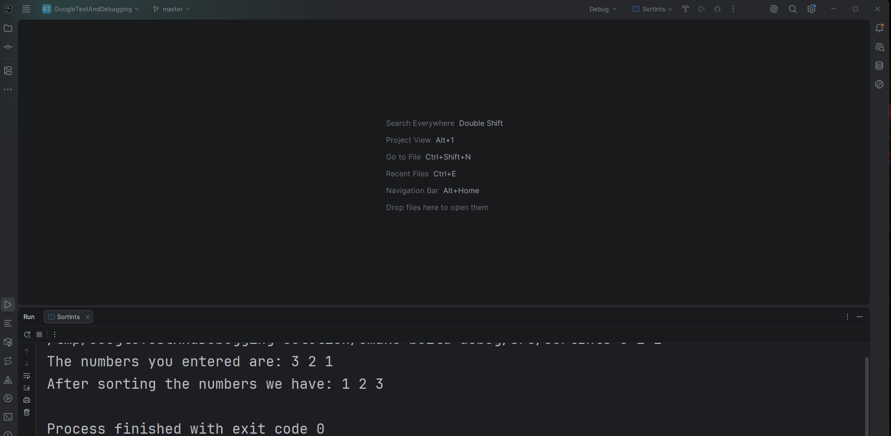

# Doubly Linked List

## Goals

1. Practice creating templated code
2. Practice creating iterators
3. Use Google Test

## Matthew’s Stats

- Time taken: 2 hours
- Files: 13
- Lines of Code: 987

## Restrictions and Requirements
- No global variables may be used
- You may **NOT** change the signatures of the provided methods
- You may **NOT** remove any methods
- You may **NOT** use any stl containers such as but not limited to `std::deque` or `std::vector`
  in your solution. Doing so will be considered cheating, and you will **be sent to SJA**.
- You **may** add additional members and methods if you wish

## Problem Description

Implement a templated library for a doubly-linked list class. A doubly linked 
list is made up of `Node`s. Each node contains
1. A value 
2. A pointer to the next element in the sequence 
3. A pointer to the previous element. 

You can think of it like the barrel of monkeys below.

Each monkey is a `Node` with its body the value and its arms the 
pointers to the next and previous `Node`s.

The way that the Doubly Linked List keeps track of its nodes is through two pointers: `head` and `tail`. 
- `head` points to the first element in the list
- `tail` points to the last element in the list 

With this structure, you end up with something that looks like

Your Doubly Linked List will be **templated over the type of element stored in `Node`.**

While Doubly Linked lists may appear similar to vectors, the way that
they store values in memory causes them to have very different performance characteristics.
- Insertion and deletion of elements at both the front and end of a Doubly Linked List are very quick 
- To do an insertion/deletion on interior elements requires you to go through all of the elements that are 
  before/after the insertion/deletion point (depending on if the position is closer to the beginning or the end)
  making them inefficient
  
To access an element in a doubly-linked list you must go through all the elements
that come before it but. This means accessing elements that are far from the 
start/end is slow. This is in contrast with a vector where the amount of time
it takes to access an element is constant regardless of its position. 

So if you primarily only access things near the front/end,
and you do frequent removals and insertions of items near the front/end, a 
Doubly Linked List is likely the better choice. If you do a lot of random 
element accesses and most of your insertions/removals are
at the end, a vector would likely be superior. 

## The Classes

### Doubly Linked List

The Doubly Linked List class.

- You will need to add the members mentioned in the problem description
- Templated over the type of element it stores

### Doubly Linked Node

A Node in the Doubly Linked List class

- I haven't given you anything here so what you do is up to you 
but make sure it has at least the members discussed in the problem description.
- Templated over the type of value that it stores

### Iterators

All the iterators you are creating are **bidirectional** iterators.

Implementing them will be a little different from what we've covered in class
because our container is not indexed based and does not possess an `at` method.
Don't worry though, the implementation is not hard.

#### Forward iterators

- `DoublyLinkedListIterator`
- `ConstDoublyLinkedListIterator`

These iterators move from the start of the list to the end of the list

#### Reverse iterators
- `ReverseDoublyLinkedListIterator`
- `ConstReverseDoublyLinkedListIterator`

These iterators move from the end of the list to the start of the list

These iterators behave similarly to `std::vector`'s reverse iterators 
and I recommend you take a look over an example if you haven't done anything 
with reverse iterators before.

## Exceptions

The string returned by the `what` method can contain anything you want it to 
but make it relevant to the problem that is happening.

### `DoublyLinkedListError`

A generic exception for representing an error that has occurred when working with 
a Doubly Linked List
- Inherits from: std::exception
- Thrown by: None

### `DoublyLinkedListEmptyError`

An exception representing that the operation could not be done because the list is empty
- Inherits from: DoublyLinkedLIstError
- Thrown by: `DoublyLinkedList::front` and `DoublyLinkedList::back`

### `DoublyLinkedListOutOfBoundsError`
An exception representing that the operation could not be done because 
the iterator is out of bounds
- Inherits from: DoublyLinkedLIstError
- Thrown by: `operator*` in the iterators

## Testing

We will once again be using Google Test to test your program. You need to implement all
the tests given, which are all simple tests. You may add more tests and I encourage you
to try and practice with some property tests. 

## Hints
- Since you are writing templated code CLion might not be as helpful 
  in suggesting autocompletes or might not be able to at all
- When you write templated code don't forget that the function **definitions** must 
  appear in the **header** file
- Since you are writing templated code, if you make an error the compiler will spit out a huge amount of errors. 
  - When trying to fix these errors, start wit the first error and don't go past that. 
  - Fix that error then recompile and then go again. 
  - Keep doing this until all the errors are fixed.
- There are many cases to consider when doing insertions/deletions with the empty list
  - Inserting/deleting the first element
  - Inserting/deleting the last element
  - Inserting/deleting an interior element
  - Inserting into an empty list
  - Deleting the only value from an empty list 
  I highly recommend drawing out each scenario and working your way through it by
  hand before you go and implement the code to carry it out
  - The test cases rely heavily on your iterators.
    - If they are not implemented or implemented incorrectly the tests will not pass

## CLion Specifics

### Setting Command Line Arguments
Command line arguments can be set by
1. Going to the configuration you want to add command line arguments to
2. Clicking  `...` next to the configuration
3. Selecting `Edit...`
4. Entering your command line arguments in `Program Arguments`

## What to Submit

Submit to GradeScope a clone of this repository with updates to it to solve the problem described.
You are allowed to create as many new files under `src` or `testing` as you
desire. 

- If you create new files under `src` make sure to add them to `${SRC_LIB_NAME}`
  - 
- If you create new files under `testing` make sure to add them to `${Testing_Name}`
  - 
